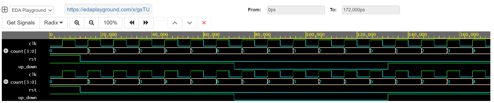

# RTL-Design-4bit-UpDown-Counter
Designed and verified a 4-bit Synchronous Up/Down Counter using Verilog HDL with a self-checking testbench and waveform simulation on EDA Playground.

# 4-bit Synchronous Up/Down Counter using Verilog

## Overview

This project implements a **4-bit Synchronous Up/Down Counter** using Verilog HDL.

The counter increments or decrements on every positive edge of the clock depending on the **up_down** control signal.

---

## Features

- Verilog HDL
- Positive Edge Triggered
- Asynchronous Reset
- Up Counter
- Down Counter
- Testbench Included
- Waveform Verification
- RTL Design

---

## Inputs

| Signal | Description |
|---------|-------------|
| clk | Clock Signal |
| rst | Asynchronous Reset |
| up_down | 1 = Up Count, 0 = Down Count |

---

## Output

| Signal | Description |
|---------|-------------|
| count[3:0] | 4-bit Counter Output |

---

## Truth Table

| Reset | Up_Down | Operation |
|--------|----------|-----------|
| 1 | X | Reset Counter to 0 |
| 0 | 1 | Count Up |
| 0 | 0 | Count Down |

---

## Simulation Result

The waveform verifies:

- Reset operation
- Up counting
- Down counting
- Switching between modes

---

## Waveform

---

## Tools Used

- Verilog HDL
- EDA Playground
- Icarus Verilog
- EPWave

---

## Author

**Dikshitha M**
